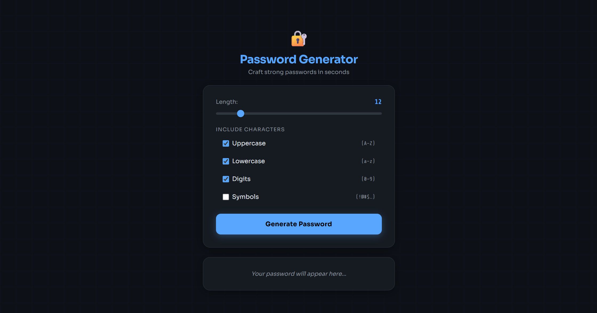
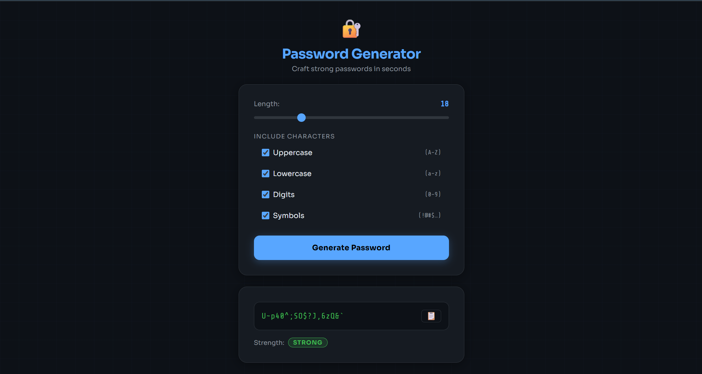
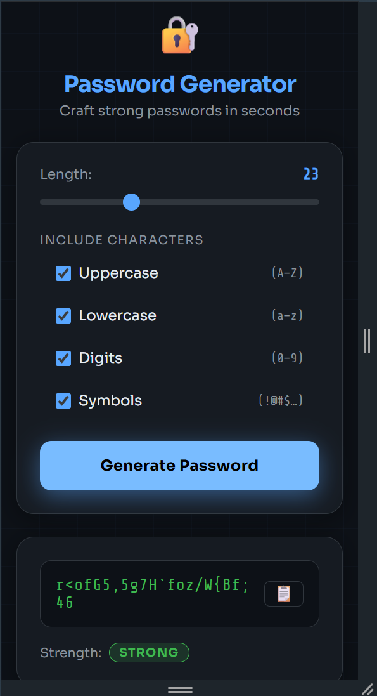

<div align="center">

# Flask Password Generator

**A cryptographically secure password generator built with Python's `secrets` module, Flask, and a glassmorphism dark-mode UI.**

[](https://python.org)
[](https://flask.palletsprojects.com)
[](LICENSE)
[Features](#-features) · [Screenshots](#-screenshots) · [Installation](#-installation) · [Usage](#-usage) · [Project Structure](#-project-structure) 

</div>

---

## Features

- **Cryptographically secure** — uses Python's `secrets` module (`os.urandom()`) instead of the predictable `random` module
- **Guaranteed character inclusion** — ensures at least one character from every selected category
- **Live strength analysis** — entropy-based scoring with crack-time estimates
- **Glassmorphism dark UI** — responsive, mobile-friendly interface with animated background
- **One-click copy** — copies password to clipboard with a toast confirmation
- **REST API** — clean JSON endpoint for programmatic access
- **Clean project structure** — modular frontend and backend organisation

---

## Screenshots


### Main Interface




*The glassmorphism card with the length slider and character-type toggles.*

### Password Generated




*A generated password displayed in monospace font with its strength bar.*

### Mobile View




*Responsive single-column layout on a 375 px viewport.*

>

---

## Installation

### Prerequisites

| Requirement | Version | Check |
|---|---|---|
| Python | 3.11 or higher | `python --version` |
| pip | latest | `pip --version` |
| Git | any | `git --version` |

### Step 1 — Clone the repository

```bash
git clone https://github.com/hashlyy/flask-password-generator.git
cd flask-password-generator
```

### Step 2 — Create a virtual environment

A virtual environment isolates this project's dependencies from the rest of your system.

```bash
# Create the environment
python -m venv venv

# Activate it
# macOS / Linux:
source venv/bin/activate

# Windows (Command Prompt):
venv\Scripts\activate.bat

# Windows (PowerShell):
venv\Scripts\Activate.ps1
```

You should see `(venv)` at the start of your terminal prompt once activated.

### Step 3 — Install dependencies

```bash
pip install -r requirements.txt
```

### Step 4 — Run the development server

```bash
python app.py
```

You should see:

```
 * Running on http://127.0.0.1:5000
 * Debug mode: on
```

Open **http://127.0.0.1:5000** in your browser. 
---

## Usage

### Web interface

Use the slider and toggles to configure your password, then click **Generate Password**. The result appears with a strength bar and a copy button.

### REST API

The `/generate` endpoint accepts a `POST` request with a JSON body and returns the password and strength label.

**Request:**

```bash
curl -X POST http://127.0.0.1:5000/generate \
     -H "Content-Type: application/json" \
     -d '{
           "length": 20,
           "uppercase": true,
           "lowercase": true,
           "digits": true,
           "symbols": false
         }'
```

**Response:**

```json
{
  "password": "aJ7fRqN2mTkW9pLcXv4B",
  "strength": "Strong"
}
```

**Request body fields:**

| Field | Type | Default | Description |
|---|---|---|---|
| `length` | integer | `12` | Password length (clamped to 4–64) |
| `uppercase` | boolean | `true` | Include A–Z |
| `lowercase` | boolean | `true` | Include a–z |
| `digits` | boolean | `true` | Include 0–9 |
| `symbols` | boolean | `false` | Include `!@#$…` |

---

## Project Structure

```
flask-password-generator/
│
├── app.py                  # Flask app — routes, password logic, strength scorer
├── requirements.txt        # Python dependencies (Flask only)
├── README.md               # This file
│
├── templates/
│   └── index.html          # Jinja2 template — rendered by Flask on GET /
│
├── static/
│   ├── css/
│   │   └── style.css       # All styles — glassmorphism, slider, badges, responsive
│   └── js/
│       └── main.js         # Frontend JS — fetch, clipboard, DOM updates
│
└── docs/
    └── screenshots/        # UI screenshots referenced in this README
```

### Key Files

- `app.py` — Flask backend and password generation logic
- `templates/index.html` — Main frontend template
- `static/css/style.css` — UI styling and responsiveness
- `static/js/main.js` — Frontend interactivity and API requests

---

## Security Notes

- Uses Python's `secrets` module for cryptographically secure randomness
- Passwords are generated per request and never stored
- Input validation prevents invalid password configurations

> **Production note:** This app runs with `debug=True` by default, which is fine for learning but **must be disabled** before any public deployment. Set `app.run(debug=False)` and put the app behind a proper WSGI server (Gunicorn, uWSGI) and HTTPS reverse proxy (Nginx, Caddy).

---

## Password Strength

Password strength is calculated using:
- password length
- character variety
- entropy estimation

Longer passwords with mixed character sets are exponentially harder to crack.

---


## License

This project is licensed under the [MIT License](LICENSE) — free to use, modify, and distribute.

---

<div align="center">

Built with Python · Flask · `secrets`

</div>
